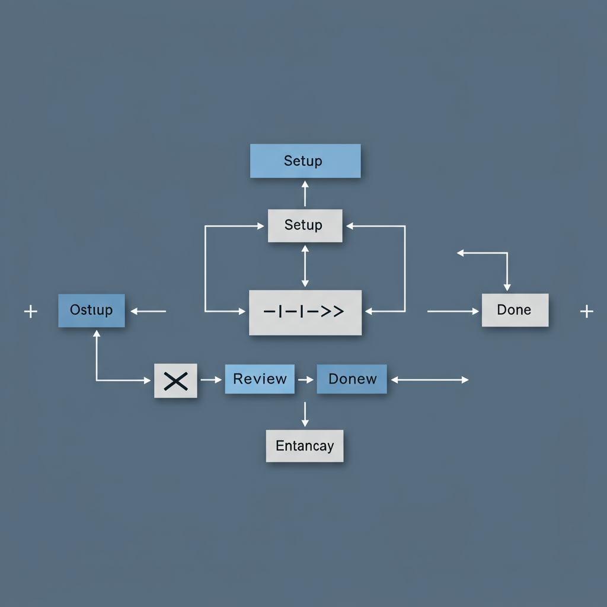

# Quick Start

Get started with code-reviewer in minutes.

## Setup

```
+--------+      +--------+      +--------+
| Setup  |----->| Review |----->| Done!  |
+--------+      +--------+      +--------+
 

## Usage

Run the following command:

```bash
reviewer -owner=myorg -repo=myrepo -pr=123
```

That's it!
